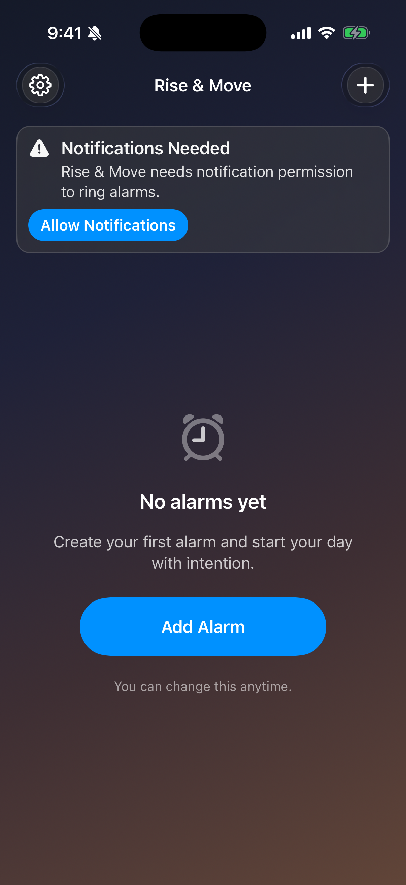
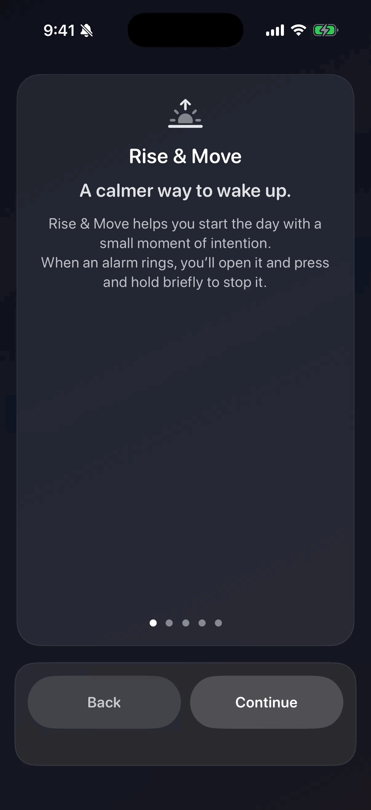

# Rise & Move

An iOS alarm app that helps you break morning autopilot by adding a short “Rise & Move” action before an alarm can be dismissed.

## What it does
- Create one-time or repeating alarms.
- Deliver alarms via local notifications, with optional backup alerts.
- Open a full-screen alarm experience when the notification is tapped.
- Stop alarms with a press-and-hold or an optional movement task.
- Offer a one-time free “Rise & Move” try, with a Pro subscription unlock.
- Provide onboarding, notification health checks, and volume guardrails.

## Screenshots

## Feature GIF

## How it works (high-level)
- Alarm data is stored in `UserDefaults` and managed by `AlarmStore`.
- Alarms are scheduled as local notifications by `NotificationManager`.
- Notification taps are routed through `NotificationDelegate` into `AppRouter`.
- The main UI flow lives in `ContentView`, which coordinates onboarding, paywall, and alarm screens.
- Pro status is read from StoreKit entitlements in `EntitlementManager`.

## Settings & guardrails
- Pro: view status, upgrade, restore purchases, and manage subscriptions.
- Onboarding: replay the onboarding flow at any time.
- Test alarm: run a test immediately or schedule a notification test.
- Audio: volume health check and quick guidance if volume is too low.
- Support and app version details.

## Notifications & alarm behavior
- Alarms are delivered via local notifications and require a tap to open the alarm screen.
- A primary alarm notification is scheduled for the next fire time.
- Optional backup alert can fire 1–60 minutes after the primary alarm.
- Time Sensitive interruption level is used on iOS 15+.
- Notification “Stop” action marks the alarm as fired (one-time alarms disable; repeats schedule next).
- The app checks notification authorization, alerts, and sounds and surfaces banners if alarms can’t ring.

## Project structure
- `Rise & Move/`: SwiftUI app source
- `Rise & Move/Rise & Move.xcodeproj`: Xcode project
- `Rise & Move/Rise & MoveTests`: Unit tests
- `Rise & Move/Rise & MoveUITests`: UI tests

## Development setup
1. Open `Rise & Move/Rise & Move.xcodeproj` in Xcode.
2. Select a simulator or device.
3. Build and run.

## Release & distribution notes
- Bundle identifier: `com.jpcostan.riseandmove`.
- StoreKit product IDs:
  - `com.jpcostan.riseandmove.pro.monthly`
  - `com.jpcostan.riseandmove.pro.yearly`
- Local StoreKit config: `Rise & Move/Rise & Move/RiseAndMove.storekit`.
- DEBUG-only paywall forcing tools live in Settings and are compile-time gated.
- Verify signing, provisioning, and deployment target in the Xcode project before TestFlight/App Store.

## Notes
- Alarm delivery depends on notification permissions and iOS notification settings.
- The app uses a calm, dark “dawn” theme throughout.

## License
All rights reserved (update this section if you intend to open source it).
